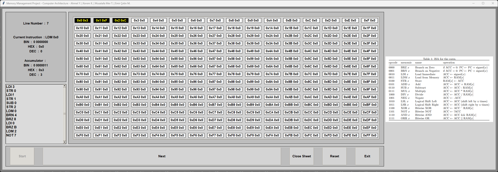
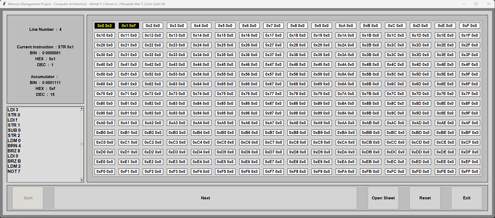

# Memory Management Simulation

The project is a Python-based simulation of a computer processor that enables users to explore the various components and functions of a processor in a controlled environment. It comprises Memory (Data Memory, Instruction Memory), Registers (Accumulator, Program Counter), ALU (Add, Subtract, Multiply, Divide, Negate, Shift Left, Shift Right, XOR, Not, And, Or), and a Control Circuit.

The program reads assembly code and uses a compiler to execute instructions. It also includes input/output components, enabling users to interact with the simulation. The simulation can be run in either a console or a GUI interface, providing a flexible and customizable user experience.

The code has been structured to ensure readability, modularity, and efficiency. The simulation includes the ability to manually cycle through the simulation or run it continuously, providing users with flexibility in their exploration. The project can serve as a valuable educational resource for those interested in learning more about the workings of a computer processor, and provides a practical way to experiment with different functions and operations.

> Some of the features of the simulation include:
* Python-based simulation of a computer processor
* Includes components such as Memory, Registers, ALU, and Control Circuit
* Reads assembly code and uses a compiler to execute instructions
* Input/output components enable user interaction with the simulation
* Can be run in console or GUI interface
* Readable, modular, and efficient code structure
* Ability to manually cycle through simulation or run continuously
* Provides practical way to experiment with different functions and operations
* Valuable educational resource for those interested in learning about computer processors

## Environment & Setup

> This project held by, `python 3.9.0` !

Step by step to setup;

* 1. Clone the repository to your local machine. `git clone $repository_link`
> The anaconda is used for environmental setup, if you don't have anaconda, you can directly move to step 4.
* 2. Create a virtual environment. `conda create -n mms python=3.9.0`
* 3. Activate the virtual environment. `conda activate mms`
* 4. Install the requirements. `pip install -r requirements.txt`
* 5. Run the program. Checkout @Usage section.

## Usage

> The program is splitted into two parts, console application and graphical usage application. The execution is default set to graphical usage. You can change it by giving arguments !

The argumentation;

> You can use `-h` or `--help` to see the argumentation. Note that, you must have completed @Environment & Setup section.

`>>> python main.py -h`

```
usage: main.py [-h] [-g GUI] [-c CONSOLE_SAVE]

This is a Python-based simulation of a computer processor that includes components such as Memory, Registers, ALU, and a Control Circuit, which reads assembly code and allows users to interact with it through input/output components. The project is
designed to be flexible, efficient, and educational, and can be run in a console or GUI interface.

options:
  -h, --help            show this help message and exit
  -g GUI, --gui GUI     Set this to False if you want to run the simulation in the console. Default is running on gui.
  -c CONSOLE_SAVE, --console-save CONSOLE_SAVE
                        Set this to True if you want to save the console output to a text file. Default is False.
```

Example of usages;

* `python main.py` : Runs the program in default mode.
* `python main.py -g 0` : Runs the program in console mode.
* `python main.py -g 1` : Runs the program in graphical mode.
* `python main.py -g 1 -c 1` : Runs the program in graphical mode and saves the console output to a text file.
* `python main.py -g 0 -c 1` : Runs the program in console mode and saves the console output to a text file.

## Screenshots

> The screenshots are taken from the graphical usage application.




## To-Do

* [x] Verification.
* [ ] Add auto run to gui.